# Documentación aplicación de scraping

## Overview
El problema que pretendemos resolver con esta aplicación está dividido en dos partes:

- **Scraping diario.** Un proceso muy liviano que se ejecuta cada ~1min para capturar el estado inicial de una incidencia, con el objetivo de comprobar cambios de estado y prioridad por parte de t-systems.
- **Scraping one shot.** Proceso más pesado que solo se lanza cuando se quieran investigar los tiempos de respuesta y resolución dentro de un determinado período. La problemática es que los tiempos proporcionados por T-Systems no son, a priori, del todo confiables y, por tanto, debemos realizar un proceso de scraping complejo de cada uno de los detalles de las incidencias correspondientes para calcular nuestros propios tiempos.

Para el proceso one shot, de manera esquemática, necesitamos establecer dos períodos. Solo investigaremos aquellas incidencias que, **o bien** se abrieran en el primer período **y** sigan abiertas actualmente **o** se cerraran en el segundo período, **o bien** se abrieran en el segundo período, independientemente de su estado actual, que se encuentra comprendido entre la segunda fecha establecida a través de la API y la actual.

## Detalles de la implementación a nivel de sistemas
| | |
|--|--|
| **Servidor desde el que se ejecuta** | 10.1.1.201 (mensajeria) |
| **Puerto que expone la API** | 8000 |
| **Ruta en donde se encuentra el código** | /opt/nexus_crawler/ |
| **Nombre del servicio diario** | nexus_scraper.service |
| **Nombre del servicio para el proceso puntual** | one_shot_crawler.service |
| **Ruta de los ficheros de configuración de los servicios** | /etc/systemd/system/ |
| **Ruta del entorno virtual de Python con las dependencias del proyecto** | /home/administrador/.pyenv/versions/nexus_crawler |
| **Cron del proceso diario** | sudo crontab -e (hacia el final del fichero están las líneas correspondientes) |

## Implementación a nivel de programación

### Árbol de ficheros del proyecto

A continuación se presenta la estructura del directorio /opt/nexus_crawler desde donde cuelga todo el código del proyecto:

- **/config/** Directorio con los ficheros de configuración necesarios.
	- **/config/nexus_scraper.service** Fichero para el servicio del proceso diario.
	- **/config/one_shot_crawler.service** Fichero para el servicio del proceso puntual.
	- **/config/cron.txt** Cron para el servicio diario.
- **/env/** Carpeta con las dependencias del proyecto.
	- **/env/requirements.txt** Fichero con las librerías necesarias para el entorno de python.
- **/web/** En este directorio se encuentran todo el código html y css que sirve la API.
	- **/templates/** Directorio del que cuelgan las plantillas html.
		- **/base.html** Contiene las cabeceras.
		- **/index.html** Página principal que actúa como root. Los elementos relevantes son un formulario con la fechas de los dos períodos mencionados y un botón para descargar los csv actualizados.
		- **/run.html** Muestra el progreso de una tarea que está actualmente ejecutándose o recientemente completada.
		- **/static/style.css** Fichero de estilo css.
- **/data/** Aquí es donde están todos los .csv con las diferentes tablas, tanto los temporales como los finales.
	- **/current_code.txt** Necesario para el scraping diario, es el registro del último código que se registró para no tener que revisar más de las $N$ últimas incidencias y hacer este proceso lo más liviano posible. *NO MODIFICAR*.
	- **/final_data.csv** Una de las tablas que devuelve el proceso one shot. Un análisis de las columnas se presenta más adelante.
	- **/initial_photos.csv** Fotos iniciales de las incidencias que el scraping diario obtiene. El proceso one shot también devuelve esta tabla ya que es entonces cuando querremos comparar cambios de estado.
	- **/paradaincidencias.csv** Tabla con la información de las pausas dentro de las diferentes incidencias para realizar el cálculo de los tiempos de forma correcta.
	- **/temp_data.csv** Se trata de la tabla csv que nos proporciona T-Systems, con todas las incidencias del ayuntamiento. Debido a que la descargamos a través de un navegador headless, tenemos que guardarla físicamente y luego cargarla en memoria. Una vez cargada, querremos realizarle diversas transformaciones.
- **/app.py** Código de la API que expone los diferentes endpoints para la interactividad a través de interfaz web. Se usan diferentes librerías que se comentaran más adelante.
- **/daily_crawler.py** Implementa la lógica del scraping diario.
- **/one_shot_crawler.py** Ídem para el proceso puntual.
- **/utilities.py** Fichero que contiene determinadas constantes necesarias.

### Diagrama de clases

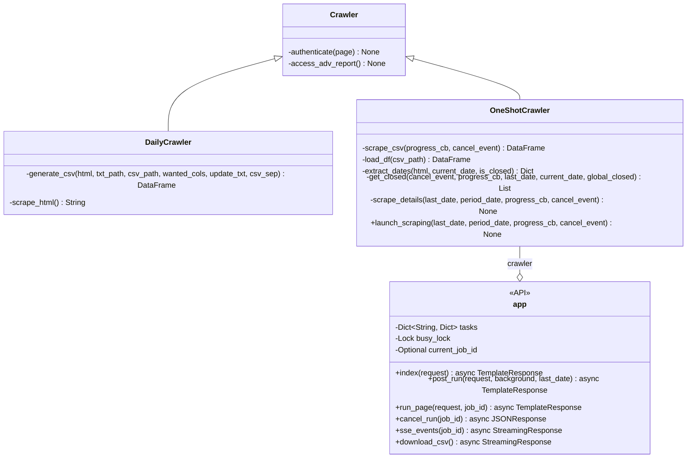

### Flujo de la computación del backend
Vamos a inspeccionar el flujo de ejecución de manera minuciosa a través de diagramas y pseudocódigo para poder entenderlo. Vamos a comenzar con el proceso diario. Lo primero que hay que entender es que este proceso no tiene dependencia alguna con el frontend y se ejecuta a través de un servicio del sistema ya que ```daily_crawler.py``` es un script por sí mismo con su propio bloque ```main()```:

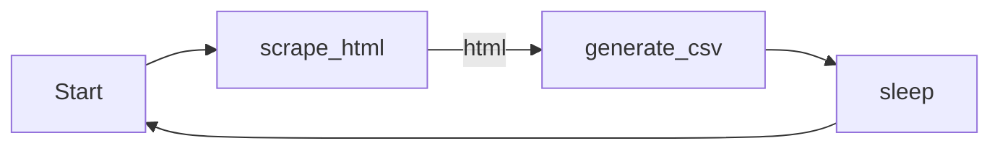

Asimismo, ```DailyCrawler::scrape_html()``` tiene el siguiente flujo:

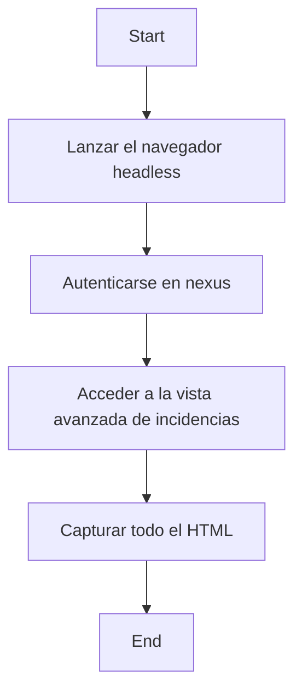

En pseudocódigo:

```python
def scrape_html() -> string {
	page <- launch_headless();
	authenticate(page);
	access_adv_report(page);
	html <- page.content();
	return html;
}
```
Se está simplificando significativamente el código ya que todo esto se realiza a través de distintas librerías cuyas dependencias se comentarán más adelante. Muchas de las funciones usadas en el pseudocódigo son simplificaciones de bloques de código complejos. Antes de seguir avanzando, resulta conveniente entender los métodos de la clase ```Crawler``` ya que los estamos usando a través de herencia. Primeramente, ```Crawler::authenticate()```:

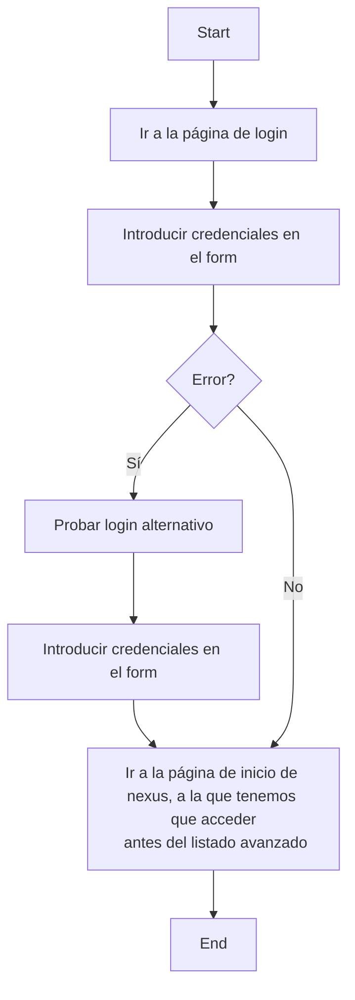

```python
def authenticate(&page) -> None {
	page <- new_page(LOGIN_URL);
	try {
		page <- page.fill_form(USERNAME, PASSWORD);
	}
	catch {
		page <- page.fill_alt_form(USERNAME, PASSWORD);
	}
	page <- page.go_to(REPORT_URL);
}
```

```&page``` denota un paso por referencia, no por copia, ```fill_alt_form()``` es el bloque de código que intenta el login alternativo, ```LOGIN_URL``` es evidente mientras que ```REPORT_URL``` es la página de inicio de incidencias del ayuntamiento, https://nexus.t-systems.es/servicedesk/customer/portal/81 . El motivo de tener que probar diferentes formas de login es que el acceso no es consistente y a veces no se puede acceder por la ruta habitual. 

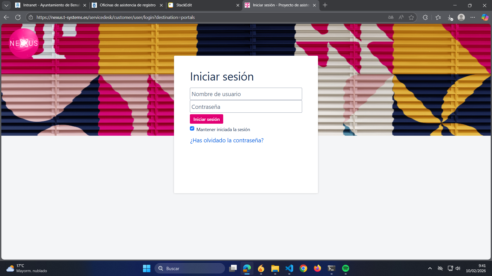

Pasamos ahora a revisar ```Crawler::access_adv_report()```:

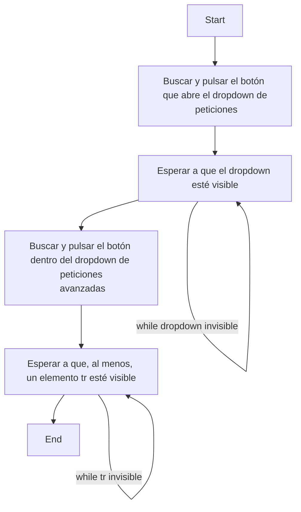

En pseudocódigo:

```python
def access_adv_report(&page) -> None {
	page <- page.click_button(DROPDOWN_BUTTON_NAME);
	page <- page.wait_for(DROPDOWN_NAME);
	page <- page.click_button(REPORT_BUTTON_NAME);
	page <- page.wait_for(TR_NAME);
}
```

en donde ```DROPDOWN_BUTTON_NAME``` es el nombre del botón que despliega el dropdown, ```REPORT_BUTTON_NAME``` es el nombre del botón dentro del dropdown que lleva a la vista avanzada de incidencias (donde se encuentra la tabla que nos interesa) y ```TR_NAME``` es el primer elemento ```<tr>``` de la tabla que aparece, para asegurarnos de que se carga bien la página. En el código real, el scraping es más complicado ya que a veces los elementos HTML se localizan por el propio nombre pero otras es a través de elementos CSS, etc... pero este es el funcionamiento básico.

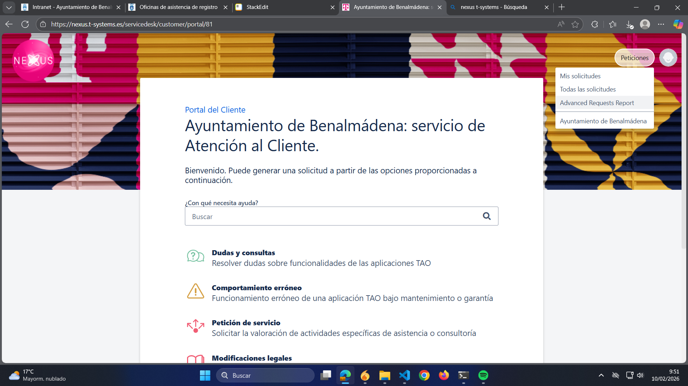

Dentro del bucle infinito que compone al ```main()``` de ```daily_crawler.py```, podemos ver que ya tenemos a la variable ```html : string```. Con ella, llamamos a la función ```DailyCrawler::generate_csv()```, que vamos a examinar a continuación:

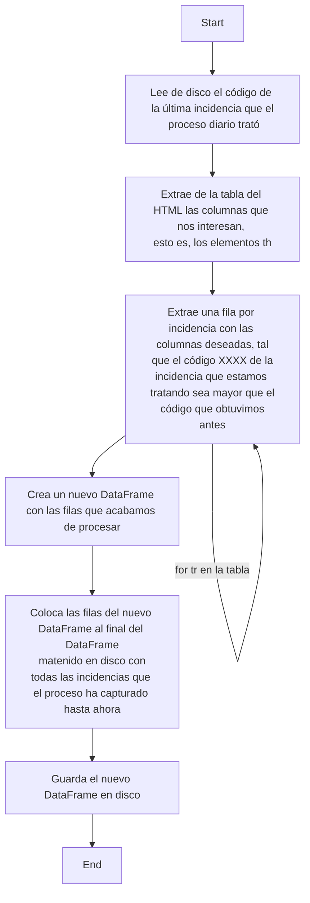

En el diagrama de flujo nos hemos saltado mucho detalle que investigaremos más profundamente con el pseudocódigo:

```python
def generate_csv(html, txt_path, csv_path, wanted_cols) -> None {
	last_num <- read_last_code(txt_path);
	
	thead <- find_thead(html);
	tbody <- find_tbody(html);

	# Esta variable es un diccionario con claves los nombres de las 
	# columnas del thead y valores
	# el índice que dichas columnas ocupan en el thead (como si de una 
	# lista se tratara). La idea es que queremos menos columnas de las que
	# la tabla html nos ofrece, por lo que usamos este diccionario
	# para relacionar ambas estructuras.
	name_to_idx <- header_index_by_name(thead);

	rows_out <- list();
	for tr in tbody {
		# Este bloque de código sirve para obtener la referencia de la
		# incidencia representada por esta fila de la tabla. Básicamente,
		# obtenemos los elementos td del tr actual y buscamos la referencia
		# en el texto del td correspondiente a la columna Referencia.
		tds <- tr.get_td_elements();
		ref_idx <- name_to_idx["Referencia"];
		ref_text <- td_extract_text(tds[ref_idx]);
		num <- extract_ref(ref_text);
		if  not (num  >  last_num) {
			continue; # Ignoramos los códigos menores que el actual
		}

		# Construimos la fila para el CSV únicamente con wanted_cols.
		# Los valores de cada columna serán los textos extraídos de cada
		# elemento td.
		row_dict <- dict();
		for col in wanted_cols {
			idx <- name_to_idx(col);
			cell_text <- td_extract_text(tds[idx]);
			row_dict[col] <- cell_text;
		}

		rows_out <- rows_out.add(row_dict);
	}

	# Creamos el DataFrame a partir de las filas obtenidas.
	df_new <- DataFrame(rows_out);

	# Leemos de disco el CSV antiguo.
	df_old <- read(csv_path);

	# Añadimos las nuevas filas y guardamos.
	df_old <- df_old.append(df_new);
	save(df_old);
}
```

Como podemos notar, para el manejo de tablas usaremos ```pandas::DataFrame```, pero hablaremos de las dependencias del proyecto más adelante. Las columnas que nos interesan son ```[Referencia, Resumen, Tipo de solicitud del cliente, Prioridad, Creada]``` ya que lo que queremos conseguir es detectar los cambios de prioridad y estado (que aparecen en la columna Prioridad y Tipo de solicitud del cliente, respectivamente).

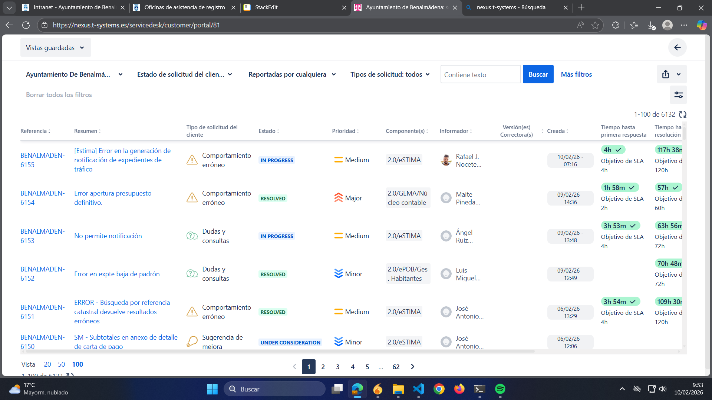

Vamos a pasar a revisar el proceso one shot. Se trata de uno más pesado que requiere de cálculos en los dataframes y de un scraping complejo en los detalles de las incidencias. La función principal que nos interesa en este caso es ```OneShotCrawler::launch_scraping()```, que es la única a la que llamará el frontend. Tiene la siguiente sencilla estructura:

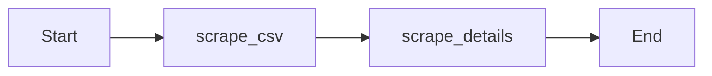

En pseudocódigo:

```python
def launch_scraping(last_date, period_date) -> None {
	scrape_csv();
	scrape_detail(last_date, period_date);
}
```

Como en otras ocasiones, se han omitido determinados detalles, como ciertos parámetros concernientes con el manejo de la barra de progreso en el frontend, que no son imprescindibles para entender el flujo. ```last_date``` y ```period_end``` se obtienen directamente del frontend y son las fechas que el usuario establece para determinar los dos períodos mencionados con anterioridad, de manera que dichos períodos son $[PeriodEnd, LastDate]$ y $[LastDate, CurrentDate]$, respectivamente. Como recordatorio, la forma en la que se procesan las incidencias viene determinada conceptualmente por la siguiente sentencia lógica:

```python
period_end: date;
last_date: date;
current_date: date;

if (inc.creation_date > last_date) {
	add_to_total(inc);
}
else if (inc.open() and inc.creation_date >= period_date) {
	add_to_total(inc);
}
else if (inc.closed_in_period() and inc.creation_date >= period_date) {
	add_to_total(inc);
}
```

donde ```inc.open()``` devuelve un ```bool``` que nos dice si la incidencia está abierta en la actualidad, ```inc.closed_in_period()``` nos dice si la incidencia se cerró dentro de $[LastDate, CurrentDate]$, e ```inc``` se puede visualizar como la abstracción de una incidencia. Aunque este pseudocódigo está bastante divorciado de la implementación real, es realmente el núcleo de lo que pretendemos hacer. 

Vamos a pasar a examinar el flujo de ```OneShotCrawler::scrape_csv()```. La principal diferencia con respecto al proceso de scraping que realizábamos anteriormente es que en ```DailyCrawler``` procesábamos el HTML en crudo para obtener el elemento tabla ya que solo necesitábamos las primeras $N$ filas (bajo la intuición de que es prácticamente imposible que surjan tantas nuevas incidencias en el corto período de tiempo entre ejecución y ejecución (~2min)), mientras que aquí vamos a necesitar el CSV completo, el cual se puede obtener haciendo que el navegador headless siga una determinada secuencia explicada en el siguiente diagrama de flujo:

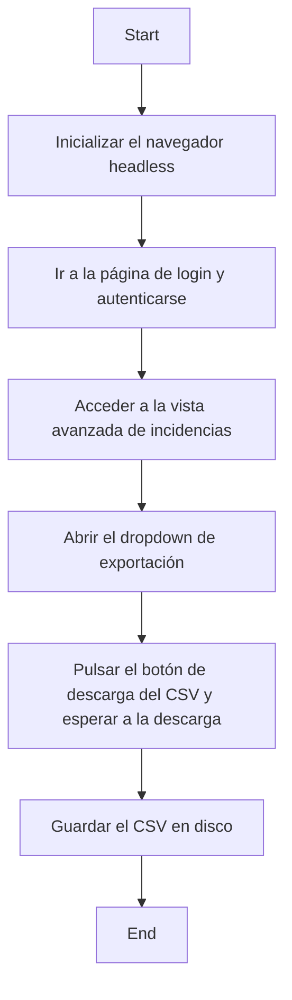

El pseudocódigo correspondiente:

```python
def scrape_csv() -> None {
	page <- launch_headless();
	authenticate(page);
	access_adv_report(page);
	page <- page.click_button(DROPDOWN_BUTTON_NAME);
	page <- page.wait_for(DROPDOWN_NAME);
	page <- page.click_button(DOWNLOAD_BUTTON_NAME);
	download <- page.wait_for_download();
	csv <- download.value();
	save(csv);
}
```

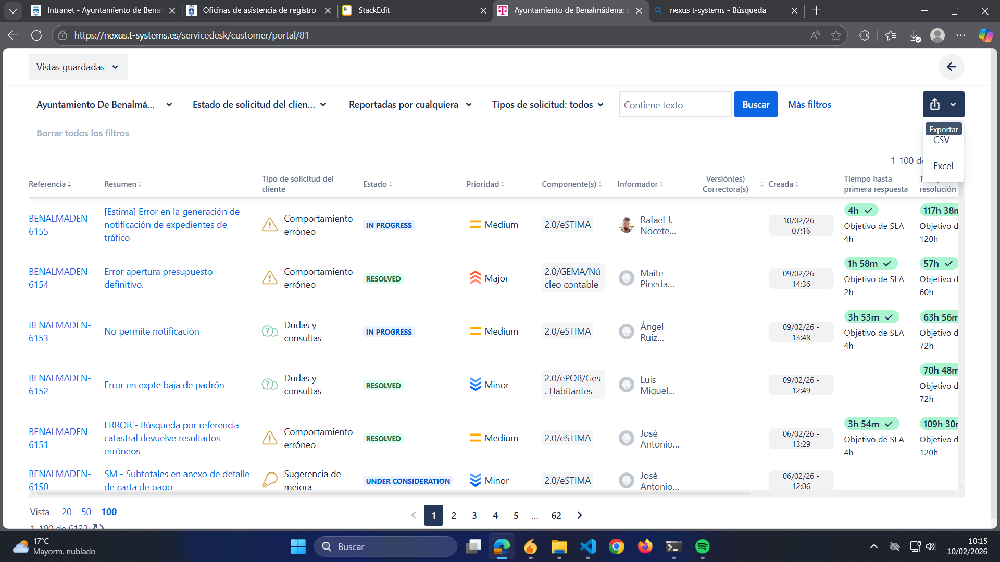

Una función importante que no aparece explícitamente en ```OneShotCrawler::launch_scraping()``` y que actúa como paso intermedio entre ```OneShotCrawler::scrape_csv()``` y ```OneShotCrawler::scrape_details()``` es ```OneShotCrawler::load_df()```. Como hemos visto, al finalizar el scrap del CSV lo mantenemos en disco; esta función lo lee y realiza una serie de cálculos importantes que vamos a revisar a continuación:

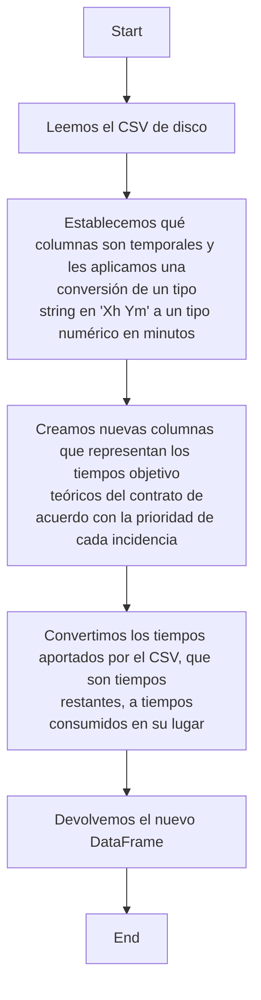

Vamos a comprobar la implementación de forma más profunda con el pseudocódigo:

```python
def duration_to_minutos(value) -> None {
	'''Función auxiliar que convierte el valor de una celda de,
	presumiblemente, un string con formato "Xh Ym" a un tipo de datos
	numérico representando la cantidad equivalente en minutos. Dicha
	función la mapearemos luego para ejecutarla a toda una columna.
	Se omiten determinados procesamientos por simplicidad'''
	
	text <- string(value);
	if not text {
		return 0.0;
	}

	# Una pecualiaridad es que el tiempo proporcionado por t-systems
	# puede ser negativo, es decir, un string "-Xh Ym". Tenemos que
	# convertir esto adecuadamente
	sign <- 1.0;
	if text.starts_with("-") {
		sign <- -1.0;
		text <- text[1:];
	}
	else if text.starts_with("+") {
		text <- text[1:];
	}

	# Tenemos ahora que obtener una estructura de datos que nos
	# proporcione en cada posición la cantidad y su correspondiente
	# unidad (días, horas o minutos). Esta estructura es una lista de pares
	# valor / unidad.
	matches: list[(string, string)] <- list();
	matches <- get_time_values(text);

	# Tenemos que iterar sobre cada cantidad individual y sumársela al total.
	total_minutes <- 0.0;
	for amount_str, unit in text {
		amount <- float(amount_str);
		unit <- unit.lower();

		if unit == "d" {
			total_minutes <- (amount * 24 * 60) + total_minutes;
		}
		else if unit == "h" {
			total_minutes <- (amount * 60) + total_minutes;
		}
		else if unit == "m" {
			total_minutes <- amount + total_minutes;
		}
		else {
			total_minutes <- amount / 60 + total_minutes;
		}
	}

	return  sign  *  total_minutes;
}

def load_df(csv_path) -> DataFrame {
	df <- read(csv_path);
	
	# Tenemos que realizarle la conversión a minutos específicamente
	# a las columnas que sean de tiempo, lógicamente. 
	duration_columns <- df[DURATION_COLUMNS];
	for column in duration_columns {
		df[column] <- df[column].apply(duration_to_minutes);
	}

	# El siguiente bloque de código es el que nos calcula las nuevas
	# columnas de tiempos teóricos.
	priority_series <- df[PRIORITY_COL];
	# Diccionarios que nos dan los tiempos respuesta y de resolución 
	# objetivo de una determinada prioridad de acuerdo al contrato
	response_goal_map <- dict({... "[priority]":[goal_time_of_priority] ...});
	resolution_goal_map <- dict({... "[priority]":[goal_time_of_priority] ...});
	# Columnas que creamos a partir del mapeo entre la prioridad de cada
	# fila y lo que nos dice el contrato que debe ser el tiempo objetivo.
	df[RESPONSE_TIME_GOAL] <- priority_series.map(response_goal_map);
	df[RESOLUTION_TIME_GOAL] <- priority_series.map(resolution_goal_map);
	
	# Pasamos ahora de tiempos consumidos a tiempos restantes con la
	# fórmula t_new = goal - t_old.
	# La siguiente estructura nos relaciona los tiempos dados en el CSV
	# con los tiempos objetivo que acabamos de calcular.
	remaining_goal_pairs <- list([
		(RESPONSE_TIME, RESPONSE_TIME_GOAL), 
		(RESOLUTION_TIME, RESOLUTION_TIME_GOAL)
	]);
	for remaining_col, goal_col in remaining_goal_pairs {
		remaining_float <- float(df[remaining_col]);
		goal_float <- float(df[goal_col]);
		
		# Aquí hay que tener en cuenta que esto es cálculo vectorial
		# entre columnas del DataFrame, no son escalares.
		consumed_time <- goal_float - remaining_float;
		df[remaining_col] <- consumed_time;
	}

	return df;
}
```

Aquí conviene hacer un receso para entender el juego de columnas que estamos realizando. Partimos del CSV con las columnas ```["Reference","Resumen","Tipo de solicitud del cliente", "Prioridad","Creada","Informador","Estado", "Tiempo hasta primera respuesta: Remaining Time", "Tiempo hasta resolución: Remaining Time", "Tiempo hasta primera respuesta: Goal", "Tiempo hasta resolución: Goal"]```. Nuestros principales problemas son que las columnas de tiempo vienen en un formato no numérico y que dichos tiempos son tiempos **restantes**, no **consumidos**. Esto quiere decir que dichos tiempos nos dicen cuánto queda hasta (o, en el caso de tiempos negativos, cuánto ha pasado desde) que los tiempos objetivo ya no se cumplen. Por tanto, tenemos que calcular cuánto tiempo se ha consumido desde primera respuesta y/o resolución en lugar de tiempo restante.

Ahora bien, estos son los tiempos proporcionados por t-systems, y querremos obtener los nuestros propios para comprobar que son correctos. Este es el objetivo de ```OneShotCrawler::scrape_details()```. Esta es una función demasiado compleja como para analizarla de una pasada, pero vamos a realizar una vista de águila a través de un diagrama de flujo de alto nivel:

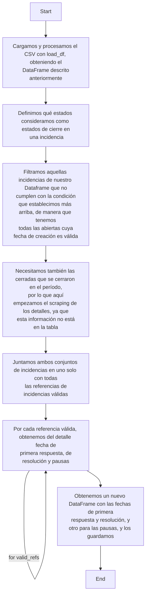

El resultado final de esta función es, por una parte, un DataFrame con columnas las del DataFrame de entrada que nos devuelve ```OneShotCrawler::load_df()``` más las columnas obtenidas de los detalles ```["Fecha Respuesta", "Fecha Resolucion"]```, y, por otra, el DataFrame de pausas, con columnas ```["Referencia", "Fecha de Parada", "Fecha de Reinicio", "Es Desarrollo"]``` en donde cada fila no es una incidencia sino una pausa y, por tanto, una incidencia puede tener varias pausas y la columna ```"Referencia"``` no tiene por qué ser única; alternativamente, una incidencia puede no tener ninguna pausa. Todo esto es relevante para el cálculo posterior por medio de Excel.

Como hemos mencionado, ```OneShotCrawler::scrape_details()``` es una función compleja y tiene, asimismo, funciones auxiliares no triviales. Vamos a empezar por ```extract_dates()```. Esta función lo que hace es iterar el detalle de una incidencia para obtener las fechas de respuesta, resolución y las pausas. La parte importante a la que queremos hacerle un proceso de scraping es una lista HTML con sus elementos ```<li>```, tal y como se observa en la imagen:

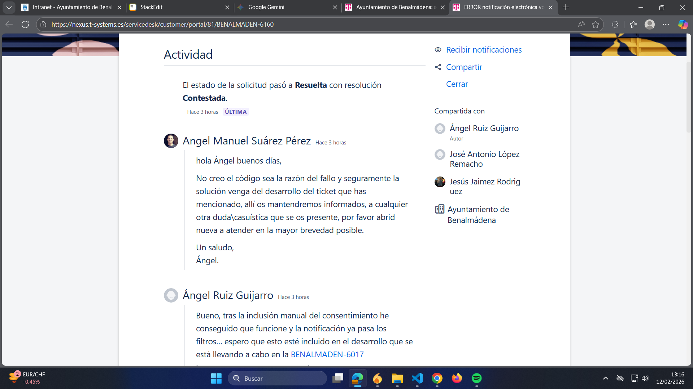

Como podemos observar, hay dos tipos de elementos en el bloque de actividad: comentarios y cambios de estado. Como veremos, la presencia de un determinado comentario puede, de hecho, implicar un cambio de estado para nuestros cálculos, por lo que ambos tipos son importantes. El flujo de la función es el siguiente:

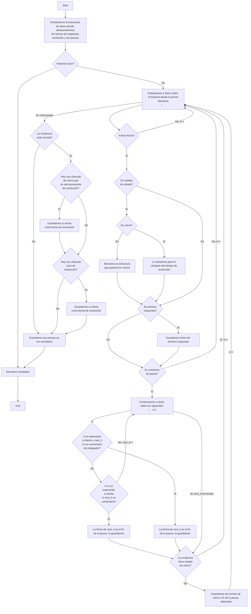

Y su pseudocódigo es el siguiente:

```python
def extract_dates(html, current_date, is_closed) -> dict {
	'''Es importante darse cuenta de que esta función procesa una única 
	incidencia y que los parámetros son de ella, el html siendo el 
	correspondiente al detalle. Devuelve los diccionarios de más abajo
	combinados en uno, con la información que scrapeemos del detalle.'''
	
	# La inicialización de estos diccionarios es importante ya que son
	# la estructura que devolveremos, y si no se cumplen los requisitos
	# los devolveremos tal cual están inicializados aquí. La intuición
	# es que si no ha habido respuesta o resolución entonces a fecha
	# de hoy sigue sin haber. Para las pausas, el hecho de que no haya
	# ninguna es simplemente un vector vacío.
	result_dates <- dict({
		"response_date" : current_date,
		"resolved_date" : current_date 
	});
	resolution_pauses <- dict({
		"stop_date" : list(),
		"restart_date" : list() 
	});

	# Si no hay histórico alguno, meramente devolvemos lo por defecto.
	activity_list <- get_detail_history(html);
	if not activity_list {
		result_dates["resolution_pauses"] <- resolution_pauses;
		return result_dates;
	}

	# Palabras clave para buscar el contenido html adecuado.
	closed_tokens <- list(CLOSED_STATES);
	resolution_tokens <- list(RESOLUTION_STATES);
	response_status_tokens <- list(RESPONSE_STATES);
	pause_status_tokens <- list(PAUSE_STATES);

	# Flag que comprueba si se ha encontrado un cambio
	# de estado de tiempo de primera respuesta. En cuanto
	# encontramos una no tenemos que buscar por más, para eso sirve
	# la flag.
	response_found <- False;
	# Estructura para guardar las cláusulas de cierre que nos encontremos.
	closure_chain <- list();

	# Iteramos elemento <li> a elemento <li> en el histórico del detalle,
	# de manera inversa porque en los detalles el último <li> es el
	# primero que se puso temporalmente.
	reversed_items <- get_li_elements(activity_list);
	for idx, li_tag in enumerate(reversed_items) {
		# Obtenemos la fecha asociada al elemento <li>.
		time_str <- parse_time(li_tag);
		if not time_str {
			continue;
		}

		# Obtenemos las clases de los elementos div para discriminar
		# entre cambios de status o comentarios de trabajador/cliente,
		# así como los propios cambios de status.
		classes <- get_li_classes(li_tag);
		labels_normalized <- status_labels(li_tag);

		# Realizamos diferentes comprobaciones sobre el li actual
		# para lógica posterior. Todos son booleans.
		is_closed_status <- has_closed_status(labels_normalized);
		is_resolution_status <- has_resolution_status(labels_normalized);
		is_worker_comment <- "worker-comment" in classes;
		is_customer_comment <- "requester-comment" in classes;
		is_comment <- is_worker_comment or is_customer_comment;
		is_status_change_event <- bool(labels_normalized) and not is_comment;

		# Comenzamos comprobando si es cierre. De serlo, lo añadimos
		# a la lista de cláusulas de cierre; en cuanto nos encontramos
		# con un <li> posterior, limpiamos la estructura ya que no
		# será un cierre final.
		if is_status_change_event {
			if is_closed_status {
				closure_chain.append(...);
			}
			else {
				closure_chain.clear();
			}
		}

		# Comprobamos si el <li> actual es un comentario de trabajador,
		# tiene cláusula de cierre que se ha producido al final o si
		# se ha producido una primera respuesta.
		response_update <- (
			is_closed_status
			or  is_worker_comment
			or  bool(labels_normalized & response_status_tokens)
		);

		# Actualizamos la fecha de respuesta y la flag para
		# iteraciones posteriores.
		if not response_found and response_update {
			result_dates["response_date"] <- time_str;
			response_found <- True;
		}

		# Exploramos ahora las posibles pausas en el tiempo
		# de resolución.
		pause_update <- (
			is_closed_status
			or match_tokens(labels_normalized, PAUSE_STATUS_TOKENS)
		);

		if pause_update {
			next_time <- None;

			is_waiting_customer <- (
				match_tokens(labels_normalized, WAITING_CUSTOMER_TOKENS)
			);

			# Comprobamos si es pausa de desarrollo para la condición
			# de que el desarrollo no puede ser mayor de 6 meses.
			is_development <- is_development_pause(labels_normalized);

			for next_li in reversed_items[idx+1:] {
				# Comprobamos que no sea un comentario de trabajador
				# para el caso de pausa tipo esperando a cliente.
				classes <- get_li_classes(next_li);
				next_is_worker_comment <- "worker-comment" in classes;
				next_is_customer_comment <- "requester-comment" in classes;

				# Únicamente paramos si hay tiempo siguiente y si no es
				# un comentario de trabajador en el caso de que sea
				# una pausa de tipo esperando a cliente.
				if is_waiting_customer and not next_is_worker_comment {
					candidate_time <- parse_time(next_li);
					if candidate_time {
						next_time <- candidate_time;
						break;
					}
					continue;
				}

				# Comprobamos ahora el caso de que no sea una pausa de tipo
				# esperando a cliente. Para cualquier casuística de este tipo
				# no tenemos en cuenta ni comentarios de trabajador ni de cliente.
				if (
					not is_waiting_customer and (
					not (next_is_worker_comment or next_is_customer_comment)
				)) {
					candidate_time <- parse_time(next_li);
					if candidate_time {
						next_time <- candidate_time;
						break;
					}
					continue;
				}
			}

			if next_time == None {
				if is_closed_status {
					# Un cierre sin un estado posterior indica cierre definitivo,
					# por lo que no debemos registrar una pausa de reapertura.
					continue;
				}
				next_time <- current_date;
			}
			resolution_pauses["stop_date"].append(time_str);
			resolution_pauses["restart_date"].append(next_time);
			resolution_pauses["is_development"].append(is_development);
		}

	# Si la incidencia está cerrada, intentamos encontrar el tiempo
	# de resolución. La prioridad es la siguiente: las resoluciones
	# puras siempre tienen la prioridad frente al resto de cierres;
	# por eso se comprueba primero si hay cierre definitivo y luego
	# si hay resolución, la cual sobreescribe el resultado anterior.
	if is_closed {
		resolved_time <- None;
		if closure_chain {
			for event in reversed(closure_chain) {
				if (not is_pure_close_event(event) and not is_resolution(event)){
					resolved_time <- event.get_time();
					break;
				}
			}
			for event in reversed(closure_chain) {
				if is_resolution(event) {
					resolved_time <- event.get_time();
					break;
				}
			}
			if not resolved_time {
				resolved_time <- closure_chain[-1].get_time();
			}
		}
		if resolved_time {
			result_dates["resolved_date"] <- resolved_time; 
		}
	}

	result_dates["resolution_pauses"] <- resolution_pauses;
	return result_dates;
}
```

Como ya hemos mencionado, la intuición alrededor de esta función es que debemos iterar el historial de la incidencia (dado por una lista HTML en donde cada elemento ```<li>``` es un posible cambio de estado) en orden inverso, buscando fundamentalmente 3 casuísticas:

- Si es una cláusula de cierre. Definimos que un ```<li>``` es cierre si y solo si su estado asociado es uno de los siguientes: ```CLOSED_STATES = ["Resuelta", "Cerrada", "Cancelada", "Hecho", "Rechazada", "Sin liberar"]```. En el pseudocódigo, podemos ver que usamos una lista ```closure_chain```, ya que, como es lógico, no podremos hacer ninguna afirmación sobre el estado de cierre de la incidencia hasta haber iterado todo el detalle, ya que las incidencias pueden reabrirse. Un detalle importante es la línea ```closure_chain.clear()```, su razón de ser es que cualquier cláusula de cierre que tiene un ```<li>``` posterior no es realmente un cierre definitivo. Una vez finalizado dicho bucle, iteramos sobre ```closure_chain``` dos veces. La idea es que el estado de resolución puro, ```RESOLUTION_STATES = ["Resuelta"]```, tiene prioridad con respecto a otros estados de cierre, pero consideramos la incidencia resuelta de todas formas si tiene un estado de cierre definitivo (es decir, que no tenga ```<li>``` posterior).
- Si la cláusula define una fecha de primera respuesta. La definición de esta viene a ser la siguiente: la primera cláusula que es, bien una cláusula de cierre, bien un comentario de trabajador, o bien una cuyo estado se encuentra en ```RESPONSE_STATES = ["En curso", "Esperando a cliente"]```. 
- Si la cláusula define una pausa en el tiempo de resolución. Consideramos que una cláusula establece el comienzo de una pausa si y solo si se encuentra dentro de ```PAUSE_STATES = ["Esperando al cliente", "En desarrollo"]```. Para buscar el fin de esta pausa tendremos que iterar los siguientes ```<li>``` al que define el comienzo de esta pausa, y romper el bucle en cuanto encontremos su fin de pausa. Tendremos que tener en cuenta la casuística del comienzo de la pausa. Si el estado del comienzo de pausa es ```"Esperando al cliente"``` entonces el fin de la pausa se dará cuando conteste el cliente o se produzca cualquier cambio de estado, pero nunca si es un comentario de trabajador. Si el comienzo es un ```<li>``` de tipo ```"En desarrollo"```, entonces el fin será cualquier cláusula que no sea un comentario (indistintamente de si es de cliente o trabajador). Finalmente, un detalle a tener en cuenta es si no encontramos un final de pausa. En este caso, puede ser que, o bien el comienzo de pausa sea un cierre definitivo, o bien cualquier otro caso. En el primero, simplemente no registraremos pausa alguna, mientras que en el segundo usaremos la fecha actual como fin de la pausa. Nota: se tuvo que añadir de última hora la columna ```"Es desarrollo"```, que simplemente indica si la pausa es de tipo "en desarrollo", debido a que hay que tenerlo en cuenta en el cálculo posterior en Excel.

De manera muy esquemática (e imprecisa), podemos simplicar el diagrama de flujo anterior en algo tal que:

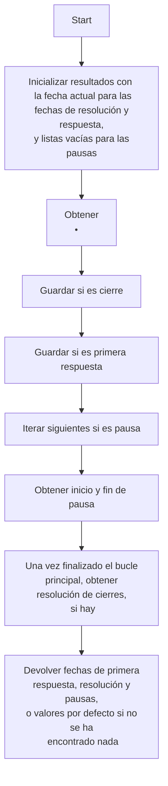

Existe otra función auxiliar de ```OneShotCrawler::scrape_details()``` relevante, ```get_closed()```. La necesidad de esta función proviene de que necesitamos obtener las incidencias cerradas dentro del período definido como el intervalo $[LastDate, CurrentDate]$. Como ya establecimos anteriormente, esto es necesario para el cómputo de los tiempos de resolución. Nuestro problema es que la fecha de cierre no es un atributo del CSV proporcionado por T-Systems, por lo que tendremos que lanzar un proceso de scraping en los detalles para obtener las incidencias con estas casuísticas y añadirlas luego a las abiertas a la fecha actual, que sí son triviales de obtener:

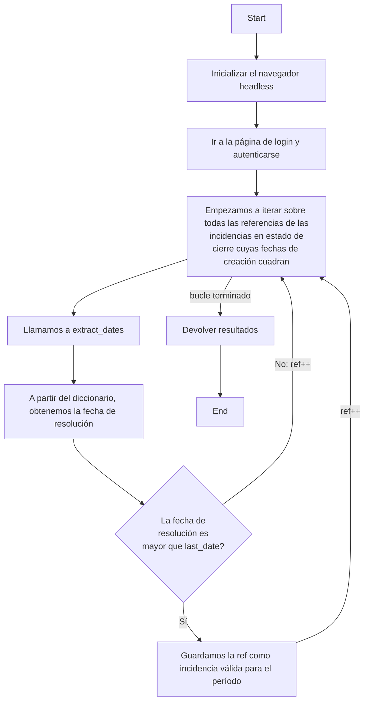

En pseudocódigo:

```python
def get_closed(last_date, current_date, global_closed) -> list {
	results <- list();
	
	page <- launch_headless();
	authenticate(page);
	
	for ref in global_closed {
		detail_url <- f"{DETAIL_URL}{ref}";
		page <- page.go_to(detail_url);
		html <- page.content();

		dates <- extract_dates(html, current_date, True);
		closed_date <- dates["resolved_date"];

		if (closed_date >= last_date) {
			results.append(ref);
		}
	}

	return results;
}
```

Ahora que hemos repasado sus componentes relevantes, vamos a elaborar el pseudocódigo para ```OneShotCrawler::scrape_details()```:

```python
def scrape_details(last_date, period_date) -> None {
	new_df <- load_df(TEMP_CSV);

	# Es el condicional del que ya hemos
	# hablado, pero usando cálculo vectorial porque estamos manejando
	# una tabla. Con una diferencia, y es que la casuística de las
	# incidencias cerradas en el segundo período no se pueden
	# obtener de esta forma.
	mask <- (
		(new_df["Creada"] > last_date) |
		(
			(~new_df["Estado"] is in CLOSED_STATES) &
			(new_df["Creada"] >= period_date)
		)
	);
	ref_codes <- new_df[mask, "Reference"];

	# El uso de set como la estructura de datos viene de que queremos que
	# los elementos sean estrictamente únicos. La máscara que se crea
	# aquí es para no tener que procesar todas las incidencias cerradas,
	# sino que filtramos las que sus fechas de creación no cuadran.
	mask_closed <- (
		(new_df["Creada"] >= period_date) & 
		(new_df["Creada"] <= last_date) &
		(new_df["Estado"].isin(CLOSED_STATES_CSV))
	);
	global_closed <- set(
		new_df[mask_closed, "Reference"].unique()
	);
	period_closed <- get_closed(last_date, global_closed);
	ref_codes.extend(period_closed);

	# Inicializamos estructuras
	dates, resolution_pauses <- dict(...), dict(...);
	current_date <- time.now();

	# Lanzamos el navegador
	page <- launch_headless();
	page <- authenticate(page);

	# Iteramos por todas las referencias válidas que hemos obtenido
	for ref in ref_codes {
		dates["reference"].append(ref);
		response_date, resolved_date <- current_date, current_date;

		is_closed <- (
			new_df[new_df["Reference"] == ref, "Estado"] in CLOSED_STATES
		);
		
		# Extraemos las fechas del detalle de ref. Es importante tener en
		# cuenta que result es la estructura para la incidencia actual
		# mientras que dates es la estructura general.
		result <- extract_dates(html, current_date, is_closed);
		dates["response_date"].append(result["response_date"]);
		dates["resolved_date"].append(result["resolved_date"]);
		
		# Por su parte, una incidencia puede tener varias pausas,
		# por lo que generaremos una fila por pausa, y podremos tener
		# referencias repetidas en resolution_pauses, a diferencia de dates.
		pauses <- result["resolution_pauses"];
		for stop, restart, is_dev in zip(pauses["stop_date"], 
					pauses["restart_date"], pauses["is_development"]) {
			resolution_pauses["reference"].append(ref);
			resolution_pauses["stop_date"].append(stop);
			resolution_pauses["restart_date"].append(restart);
			resolution_pauses["is_development"].append(is_dev);
		}
	}

	# Dataframe final con las incidencias que nos interesan.
	final_df <- new_df[new_df["Reference"] is in (ref_codes)].copy();
	
	# Dataframe intermedio con las fechas de respuesta y resolución obtenidas
	dates_df <- DataFrame(dates);

	# Procesamos ambos dataframes para obtener el final con las fechas
	final_df <- final_df.merge(dates_df, on="Reference", how="left");
	save(final_df);

	# Creamos ahora el dataframe correspondiente para las pausas
	pauses_df <- DataFrame(resolution_pauses);
	save(pauses_df);
}
```

### Flujo de la computación del frontend

La aplicación expone una interfaz web en ```http://10.1.1.201:8000``` para poder introducir las fechas de los períodos que nos interesan.

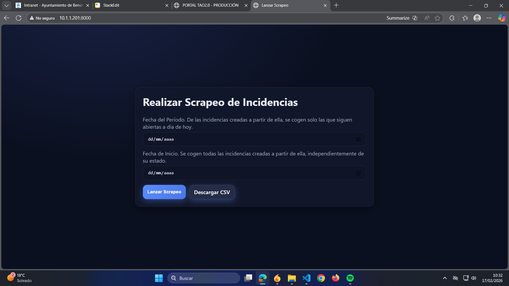

Primeramente, vamos a necesitar un esquema concurrente para manejar las peticiones paralelas de los usuarios. En realidad, esto no es nada complejo ya que no vamos a querer que haya más de un proceso de scraping ejecutándose al mismo tiempo, por lo que la implementación consiste de un ```lock``` básico que redirige cualquier usuario que pretenda iniciar una nueva tarea a la que se está ejecutando actualmente. Sí que hay que tener en cuenta que esta es una tarea **asíncrona**, ya que no queremos congelar la interfaz mientras se está ejecutando. 

Vamos a elaborar una serie de diagramas de secuencia para los diferentes casos de uso de la aplicación y, así, entender los distintos endpoints de la API. En particular, vamos a comenzar con lo que ocurre cuando el usuario inicia la página principal:

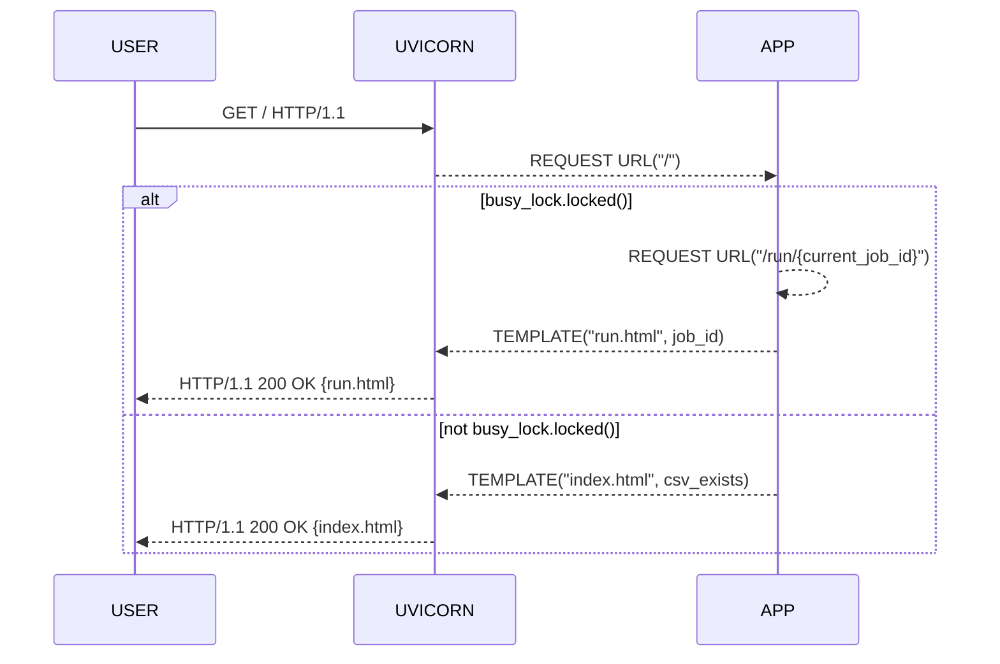

Tenemos un endpoint ```"/"``` (asociado a la función ```index()```) en la API que actúa como el index de la aplicación. Al llamar al endpoint, el proceso comprueba si ```busy_lock``` está bloqueado; si es así, redirige a la vista del progreso de la tarea, ```run.html```, a través del endpoint ```/run/{current_job_id}``` (correspondiente a ```run_page()```).

Una vez dentro, el usuario verá que puede introducir las fechas y, además, que le aparecen dos botones: uno para lanzar el proceso de scraping y otro para descargar los archivos CSV de la última ejecución con éxito. Vamos a ver la secuencia de eventos para el primer caso:

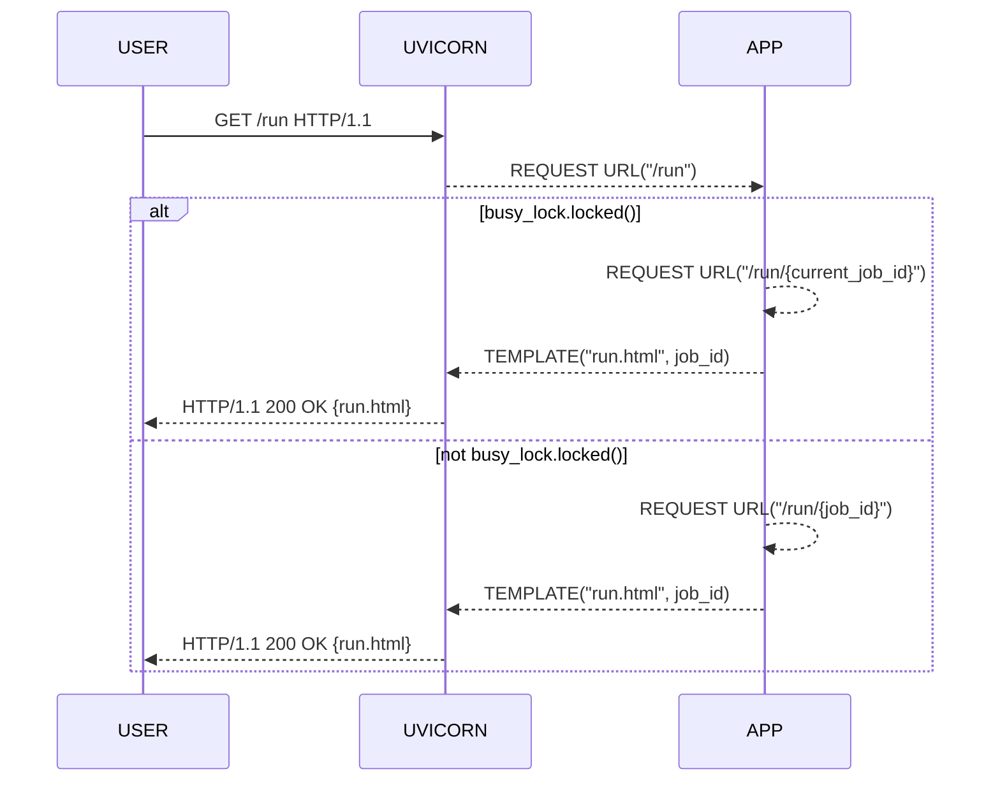

Posiblemente este diagrama no sea de gran ayuda ya que es de demasiado alto nivel para entender la lógica interna. La diferencia entre las partes del bloque alt es sutil: que el candado esté cerrado significa que ya hay una tarea de scraping, por lo que usamos ```current_job_id```; de lo contrario, tendremos que lanzar la corrutina para una nueva tarea, en cuyo caso usaremos el ID de la nueva tarea, ```job_id```, para llamar al endpoint asociado a ```run_page()```. La función correspondiente a ```"/run"``` es ```post_run()```, que de por sí no es tan interesante ya que fundamentalmente comprueba lo mencionado con ```busy_lock```. Lo importante es que lanza la tarea asíncrona por medio de la función ```schedule()```, que a su vez actúa de interfaz para ```_runner()```, que es la tarea asíncrona en sí. La idea conceptual es que se crea un hilo de ejecución paralela, siguiendo el siguiente pseudocódigo:

```python
async def schedule(job_id, last_date, period_date) {
	async def _runner(job_id, last_date, period_date) {
		state <- &tasks[job_id];

		try async with busy_lock {
			if state.is_cancelled() {
				state <- mark_cancelled();
				return;
			}

			current_job_id <- job_id;
			state <- mark_running();

			try {
				launch_thread(crawler.launch_scraping, last_date, period_date);
			}
			except CancelledError {
				state <- mark_cancelled();
				return;
			}

			if state.is_cancelled() {
				state <- mark_cancelled();
				return;
			}

			state <- mark_as_done();
		}
		except CancelledError {
			state <- mark_cancelled();
		}
		except Exception {
			state <- mark_generic_error();
		}
		finally {
			current_job_id <- None;
			tasks[job_id].pop();
		}
	}

	task <- run_coroutine(_runner(job_id, last_date, period_date));
	state <- &tasks[job_id];
	state <- task;
}
```

Confiamos en que la anterior computación se entienda adecuadamente sin muchos problemas, meramente se realiza un juego con el estado de la tarea, que, si tuviéramos un sistema realmente concurrente, sería un recurso compartido y tendríamos que preocuparnos por implementar un sistema no trivial, pero como no es el caso está bien así. 

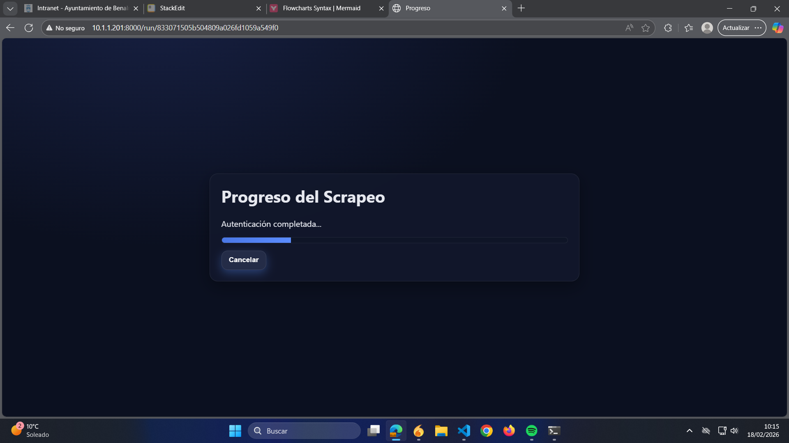

Es interesante también comentar que, una vez lanzada la tarea, la página que se nos muestra, ```run.html```, tiene una cierta cantidad de código javascript no trivial ya que necesita mostrar a tiempo real el progreso de la tarea. A lo largo de este documento se ha obviado (y no se explorará con mucho detalle, en aras de facilitar la compresión de los otros componentes más relevantes) determinados bloques de código a lo largo de la ejecución del scraping en el backend que proporcionan actualizaciones en streaming del estado de dicho scraping para que se puedan mostrar en esta vista de la interfaz web. El endpoint de la API que permite toda esta comunicación es ```"/events/{job_id}"```, asociado a la función ```sse_events```. Dicho endpoint lanza un hilo paralelo (al estilo de ```schedule()```) que está constantemente ofreciendo un payload en formato json con la información correspondiente al estado de la tarea. Dicho json es un diccionario con claves ```{"status", "progress", "message"}```, que vendría a ser el estado mencionado en el pseudocódigo de la función ```schedule()```, de manera que, a través de un ```yield``` se proporciona al javascript de ```run.html``` para que la barra de progreso se actualice y para mostrar el mensaje proporcionado en el payload, que puede ser meramente de información del estado actual de la tarea o un mensaje de error.

Como se puede comprobar, la interfaz proporciona un botón de cancelar el proceso de scraping si se desea. El endpoint asociado a dicho botón es ```"/run/{job_id}/cancel"```, con función ```cancel_run()```. Es relativamente simple ya que lo único que hace es alterar el estado de la tarea almacenado en ```tasks[job_id]```, que, como hemos visto, actúa como una suerte de recurso compartido, por lo que el proceso asíncrono de scraping que se encuentra a la escucha de algún cambio en el estado será informado correctamente y el hilo se cancelará. Gracias a la lógica del javascript también se producen los cambios en el frontend oportunos.

El último caso de uso es en el que el usuario pulsa el botón de descargar CSV. Lo que ocurre entonces es que se llama al endpoint ```/download``` con función ```download_csv()```, el cual es muy sencillo y meramente devuelve los CSVs que estén disponibles en disco en formato zip.

## Dependencias con librerías
A lo largo de la implementación, se han mencionado diferentes funciones ficticias dentro del pseudocódigo y de los diferentes flujos para mostrar la lógica subyacente. A continuación se listan las distintas librerías que se han utilizado a lo largo del proyecto para su implementación real:

- **fastapi.** Librería que nos proporciona las primitivas para construir nuestra API con sus endpoints correspondientes.
- **asyncio.** Esta dependencia es relevante para el manejo de hilos y concurrencia, de forma que podamos lanzar las tareas asíncronas que hemos comentado anteriormente sin bloquear la interfaz de usuario.
- **pandas.** A lo largo del documento hemos mencionado el uso de ```pandas::DataFrame``` como la estructura que usamos para manipular las diferentes tablas relevantes en nuestro procesamiento. Se trata de una librería altamente optimizada para cálculo vectorial que nos permite, por ejemplo, sumar columnas, añadir columnas, etc...
- **playwright.** Es la librería que nos permite lanzar el navegador headless para la tarea de scraping.
- **beautifulsoup.** Con esta dependencia logramos procesar código HTML de forma eficiente para obtener los elementos necesarios (```<li>```...) que hemos comentado anteriormente.

Se han obviado otros paquetes que suelen venir por defecto con cualquier instalación básica de python. En cualquier caso, el entorno virtual de python mencionado anteriormente cuenta con un listado explícito.

## Notas finales
El proceso de scraping es, francamente, uno un tanto inseguro. Existen muchas variables fuera de nuestro control y, a lo largo de las extensivas pruebas que se han realizado, se han encontrado inconsistencias, errores debidos a timeouts... En particular, es importante notar que es posible que, al lanzar una tarea de scraping, salte un error debido precisamente a timeouts, pese a que los tiempos establecidos en el código son más que generosos. Es posible, por ejemplo, que salte un error de fichero/directorio no encontrado, lo cual en realidad no es más que un timeout. Las buenas noticias son que, en todos los casos que se han intentado, el error solo salta al principio del scraping y solo es necesario volver a lanzarlo para que se ejecute correctamente.

Por otra parte, cualquier proceso de scraping es extremadamente frágil a cualquier cambio que T-Systems haga al frontend de su aplicación. Este proyecto ha requerido una investigación importante del código expuesto por dicha aplicación, por lo que el mantenimiento es prioritario y muy delicado, hay que estar a la escucha de los cambios en el frontend del sitio web al que estamos haciendo scraping.